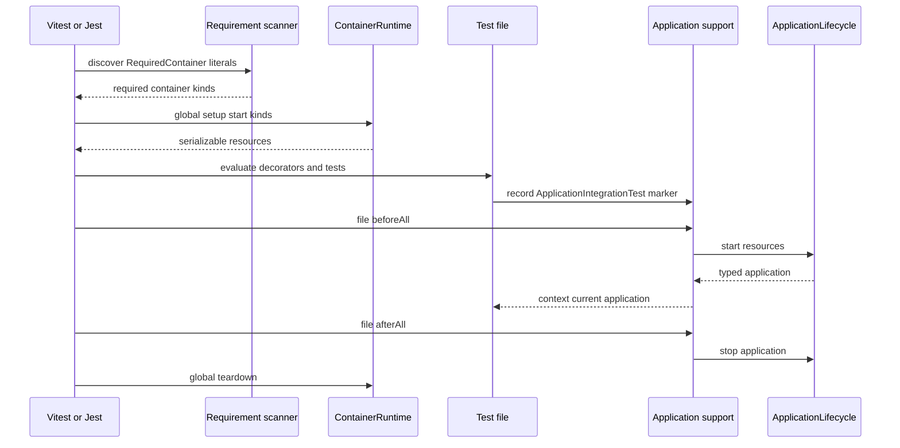

# container-integration-testing

Typed, run-scoped Testcontainers lifecycle support for Node.js integration tests.

The package provides runner-neutral container and application primitives, annotation-first
Vitest and Jest adapters, a built-in SQL Server adapter, shared container networking, and an
extension point for consumer-defined containers.

Containers live for one test command. One container of each required kind is shared by all
test files in that command, then every owned container and the shared network are removed.
Testcontainers reuse and named database volumes are not enabled.

## Requirements and installation

- Node.js 22.22 or newer
- TypeScript 5.5 to 6.x when decorators or declaration generation are used
- Vitest 4.x for `container-integration-testing/vitest`
- Jest 30.x for `container-integration-testing/jest`
- A Docker-compatible container runtime

After publication, install the package and the runner used by the consuming project:

```bash
npm install --save-dev container-integration-testing vitest
```

or:

```bash
npm install --save-dev container-integration-testing jest
```

The built-in SQL Server adapter uses `testcontainers` and
`@testcontainers/mssqlserver`, which are runtime dependencies of this package.

## Annotation responsibilities

| Declaration | Responsibility | Starts an application |
| --- | --- | --- |
| `@RequiredContainer(Container.SqlServer)` | Declares infrastructure that global setup must start | No |
| `@ApplicationIntegrationTest` | Activates the application lifecycle installed by runner setup | Yes |
| Both annotations | Starts containers globally, then starts the application for that test file | Yes |
| No annotations | Uses only explicit `ContainerRuntime` or `IntegrationEnvironment` calls | Only when explicitly requested |

`@RequiredContainer` never contains credentials and never starts Docker during decorator
evaluation. Runner global setup scans literal annotations before test modules load. The
runtime decorator metadata is later used to validate the application marker.

Exactly one `@ApplicationIntegrationTest` class is allowed in an application test file. The
same class must declare at least one `@RequiredContainer(...)`. Container-only, migration,
messaging, and persistence tests omit the application marker when no application should start.

## Annotation lifecycle



The global runtime starts before worker test files and is shared for the complete command.
The application starts only for an annotated file and stops when that file finishes.

## Vitest with annotations

### Global container lifecycle

Create one global setup module for the integration-test project:

```ts
// test/vitest.container.global-setup.ts
import { createDefaultContainerRegistry } from 'container-integration-testing';
import {
  createVitestContainerGlobalSetup,
} from 'container-integration-testing/vitest';

const lifecycle = createVitestContainerGlobalSetup({
  root: new URL('..', import.meta.url).pathname,
  registry: createDefaultContainerRegistry(),
});

export const setup = lifecycle.setup;
export const teardown = lifecycle.teardown;
```

### Application setup

Install the application lifecycle once through a Vitest setup module:

```ts
// test/api-application.vitest.setup.ts
import { Container } from 'container-integration-testing';
import {
  installVitestApplicationIntegrationTestSupport,
} from 'container-integration-testing/vitest';
import { createApplication } from '../src/create-application.js';

export const apiIntegrationTestContext =
  installVitestApplicationIntegrationTestSupport({
    start: async (resources) => {
      const sqlServer = resources.get(Container.SqlServer);
      const application = await createApplication({
        database: {
          host: sqlServer.host,
          port: sqlServer.port,
          database: sqlServer.database,
          username: sqlServer.username,
          password: sqlServer.password,
        },
      });
      await application.listen(0, '127.0.0.1');
      return application;
    },
    stop: (application) => application.close(),
  });
```

Configure both modules:

```ts
// vitest.integration.config.ts
import { defineConfig } from 'vitest/config';

export default defineConfig({
  test: {
    include: ['**/*.container.integration.test.ts'],
    globalSetup: ['./test/vitest.container.global-setup.ts'],
    setupFiles: ['./test/api-application.vitest.setup.ts'],
    hookTimeout: 240_000,
    testTimeout: 30_000,
  },
});
```

The test file contains only annotations and typed context access:

```ts
import {
  ApplicationIntegrationTest,
  Container,
  RequiredContainer,
} from 'container-integration-testing';
import { expect, test } from 'vitest';
import { apiIntegrationTestContext } from './api-application.vitest.setup.js';

@RequiredContainer(Container.SqlServer)
@ApplicationIntegrationTest
export class CandidateApiIntegrationTest {}

test(
  'given the API is running, when health is requested, then the application responds successfully',
  async () => {
    const application = apiIntegrationTestContext.current();
    const response = await application.inject({ method: 'GET', url: '/health' });

    expect(response.statusCode).toBe(200);
  },
);
```

Vitest global setup owns the shared containers. The setup file registers `beforeAll` and
`afterAll` for each test file. An unannotated file remains inactive.

## Jest with annotations

Jest global setup cannot expose arbitrary global values to test suites, as described in the
[Jest global setup documentation](https://jestjs.io/docs/30.0/configuration#globalsetup-string).
The adapter writes only serializable container resources to a permission-restricted temporary
file and places only that generated file path in the environment inherited by workers.
Credentials and connection strings are never placed directly in environment variables.
Global teardown stops the runtime and removes the temporary directory.

### Global container lifecycle

Define one shared lifecycle object:

```ts
// test/jest.container.global-lifecycle.ts
import { createDefaultContainerRegistry } from 'container-integration-testing';
import {
  createJestContainerGlobalSetup,
} from 'container-integration-testing/jest';

export const containerLifecycle = createJestContainerGlobalSetup({
  root: new URL('..', import.meta.url).pathname,
  registry: createDefaultContainerRegistry(),
});
```

Export its two callbacks from the modules referenced by Jest:

```ts
// test/jest.container.global-setup.ts
import { containerLifecycle } from './jest.container.global-lifecycle.js';

export default containerLifecycle.setup;
```

```ts
// test/jest.container.global-teardown.ts
import { containerLifecycle } from './jest.container.global-lifecycle.js';

export default containerLifecycle.teardown;
```

Install application hooks after the Jest environment is available:

```ts
// test/api-application.jest.setup.ts
import { Container } from 'container-integration-testing';
import {
  installJestApplicationIntegrationTestSupport,
} from 'container-integration-testing/jest';
import { createApplication } from '../src/create-application.js';

export const apiIntegrationTestContext =
  installJestApplicationIntegrationTestSupport({
    start: async (resources) => {
      const sqlServer = resources.get(Container.SqlServer);
      const application = await createApplication({
        database: {
          host: sqlServer.host,
          port: sqlServer.port,
          database: sqlServer.database,
          username: sqlServer.username,
          password: sqlServer.password,
        },
      });
      await application.listen(0, '127.0.0.1');
      return application;
    },
    stop: (application) => application.close(),
  });
```

Configure Jest 30:

```ts
// jest.integration.config.ts
import type { Config } from 'jest';

const config: Config = {
  testMatch: ['**/*.container.integration.test.ts'],
  globalSetup: './test/jest.container.global-setup.ts',
  globalTeardown: './test/jest.container.global-teardown.ts',
  setupFilesAfterEnv: ['./test/api-application.jest.setup.ts'],
  testTimeout: 30_000,
};

export default config;
```

The Jest test has the same annotations and context shape as the Vitest test. Only the test
API import and setup-context module change:

```ts
import { expect, test } from '@jest/globals';
import {
  ApplicationIntegrationTest,
  Container,
  RequiredContainer,
} from 'container-integration-testing';
import { apiIntegrationTestContext } from './api-application.jest.setup.js';

@RequiredContainer(Container.SqlServer)
@ApplicationIntegrationTest
export class CandidateApiIntegrationTest {}

test(
  'given the API is running, when health is requested, then the application responds successfully',
  async () => {
    const application = apiIntegrationTestContext.current();
    const response = await application.inject({ method: 'GET', url: '/health' });

    expect(response.statusCode).toBe(200);
  },
);
```

TypeScript execution still requires the consumer's normal Jest transformer or precompile
step. This package coordinates lifecycle and does not select Babel, SWC, or ts-jest.

## Using containers without annotations

Annotations are optional. A Cucumber world, migration script, custom runner, or ordinary
program can own a runtime directly:

```ts
import {
  Container,
  ContainerRuntime,
  createDefaultContainerRegistry,
} from 'container-integration-testing';

const runtime = new ContainerRuntime(createDefaultContainerRegistry());
const resources = await runtime.start([Container.SqlServer]);

try {
  const sqlServer = resources.get(Container.SqlServer);
  await runMigrations(sqlServer);
  await runScenarios(sqlServer);
} finally {
  await runtime.stop();
}
```

When an application must follow container ownership, use `IntegrationEnvironment`:

```ts
import {
  Container,
  IntegrationEnvironment,
  OwnedContainerSource,
  createDefaultContainerRegistry,
} from 'container-integration-testing';

const environment = new IntegrationEnvironment({
  requiredContainers: [Container.SqlServer],
  containers: new OwnedContainerSource(createDefaultContainerRegistry()),
  application: {
    start: (resources) => startApplication(resources),
    stop: (application) => application.close(),
  },
});

await environment.start();
try {
  await runCucumberFeatures(environment.current());
} finally {
  await environment.stop();
}
```

`OwnedContainerSource` owns and stops its runtime. `ProvidedContainerSource` validates and
reuses resources owned by runner global setup, so its `stop()` is intentionally a no-op.

## Implementing a custom container

Consumers can add a container without changing this package.

### Define the typed resource and catalog

Augment the stable resource-map subpath, then define a catalog. The helper automatically
includes built-in entries such as `SqlServer`:

```ts
// test/container-catalog.ts
import { defineContainerCatalog } from 'container-integration-testing';

export interface PostgresResource {
  readonly kind: 'postgres';
  readonly host: string;
  readonly port: number;
  readonly username: string;
  readonly password: string;
  readonly database: string;
}

declare module 'container-integration-testing/container-resource-map' {
  interface ContainerResourceMap {
    readonly postgres: PostgresResource;
  }
}

export const containerCatalog = defineContainerCatalog({
  Postgres: 'postgres',
});
```

### Implement and register the adapter

Keep the native Testcontainers handle inside the adapter. Return only consumer-facing,
serializable connection data:

```ts
import {
  type Container as ManagedContainer,
  type ContainerStartOptions,
} from 'container-integration-testing';
import {
  GenericContainer,
  type StartedNetwork,
  type StartedTestContainer,
} from 'testcontainers';
import {
  containerCatalog,
  type PostgresResource,
} from './container-catalog.js';

export class PostgresTestContainer
  implements ManagedContainer<PostgresResource>
{
  readonly kind = containerCatalog.Postgres;
  private started: StartedTestContainer | undefined;

  async start(options: ContainerStartOptions = {}): Promise<PostgresResource> {
    let container = new GenericContainer('postgres:17-alpine')
      .withEnvironment({
        POSTGRES_USER: 'integration',
        POSTGRES_PASSWORD: 'Container!Postgres2026',
        POSTGRES_DB: 'integration',
      })
      .withExposedPorts(5432);

    if (options.network !== undefined) {
      container = container.withNetwork(options.network.native as StartedNetwork);
    }
    if (options.networkAliases !== undefined) {
      container = container.withNetworkAliases(...options.networkAliases);
    }

    const started = await container.start();
    this.started = started;
    return {
      kind: this.kind,
      host: started.getHost(),
      port: started.getMappedPort(5432),
      username: 'integration',
      password: 'Container!Postgres2026',
      database: 'integration',
    };
  }

  async stop(): Promise<void> {
    await this.started?.stop();
    this.started = undefined;
  }
}
```

Register it alongside the built-in adapters:

```ts
import { createDefaultContainerRegistry } from 'container-integration-testing';
import { containerCatalog } from './container-catalog.js';
import { PostgresTestContainer } from './postgres-test-container.js';

export const registry = createDefaultContainerRegistry().register(
  containerCatalog.Postgres,
  () => new PostgresTestContainer(),
);
```

Pass the same catalog to Vitest or Jest global setup:

```ts
createVitestContainerGlobalSetup({
  root: new URL('..', import.meta.url).pathname,
  registry,
  containerNames: containerCatalog,
});
```

Import the catalog under the literal name `Container` in annotated files. Static discovery
requires this form because global setup must discover requirements without executing tests:

```ts
import { RequiredContainer } from 'container-integration-testing';
import { containerCatalog as Container } from './container-catalog.js';

@RequiredContainer(Container.Postgres)
export class PostgresMigrationIntegrationTest {}
```

After startup, lookup remains fully typed:

```ts
const postgres = resources.get(Container.Postgres);
```

## Multiple containers and networking

`@RequiredContainer` accepts one or more kinds and removes duplicates:

```ts
@RequiredContainer(Container.SqlServer, Container.Postgres)
@ApplicationIntegrationTest
export class MessagingApiIntegrationTest {}
```

`ContainerRuntime` starts different kinds concurrently. Every container joins one shared
network and receives its kind as a default alias. Containers can therefore reach peers by
stable aliases such as `sql-server` and `postgres`. Host-side applications use each
resource's host and random mapped port instead.

Repeated and concurrent runtime `start()` calls reuse the same promise per kind. `stop()` is
idempotent, stops containers in reverse successful-start order, and removes the network last.

## Ports, credentials, and resource transfer

SQL Server listens on port 1433 inside Docker. Testcontainers maps it to an available host
port. The built-in adapter returns the actual values after readiness:

```ts
const sqlServer = resources.get(Container.SqlServer);

sqlServer.host;
sqlServer.port;
sqlServer.username;
sqlServer.password;
sqlServer.database;
```

The container package deliberately does not build Prisma, Drizzle, TypeORM, ADO.NET, or
application-specific connection strings. It exposes typed connection facts, and the
consumer or an optional client adapter converts those facts into the format its database
client accepts. The library never predicts a host port and does not log passwords or complete
connection strings.

Vitest transfers plain resources through `project.provide()` and `inject()`. Jest transfers
the same serializable shape through its protected temporary document.

## Application lifecycle and ownership

`ApplicationLifecycle<TApplication>` is runner-neutral:

```ts
interface ApplicationLifecycle<TApplication> {
  start(resources: ContainerResources): Promise<TApplication>;
  stop(application: TApplication): Promise<void>;
}
```

Startup order is containers, then application. Shutdown order is application, then
containers. If application startup fails, the owning environment cleans up its container
source before rethrowing. Cleanup attempts all owned resources and reports multiple failures
through `AggregateError`.

The previous `useIntegrationEnvironment()` Vitest helper was removed before publication.
Application test files now use `@ApplicationIntegrationTest`, while one runner setup module
installs the lifecycle and exports the typed context.

## Logging

Lifecycle logging is enabled by default. Every line begins with a UTC ISO timestamp and an
`[integration:<scope>]` prefix. Container output uses
`[integration:container:<kind>]`.

Use the Testcontainers debug stream when image pulls or runtime discovery fail:

```bash
DEBUG=testcontainers* npm run test:integration
```

Consumers can replace lifecycle logging through `ContainerRuntimeOptions.logger` or
`IntegrationEnvironmentOptions.logger`.
