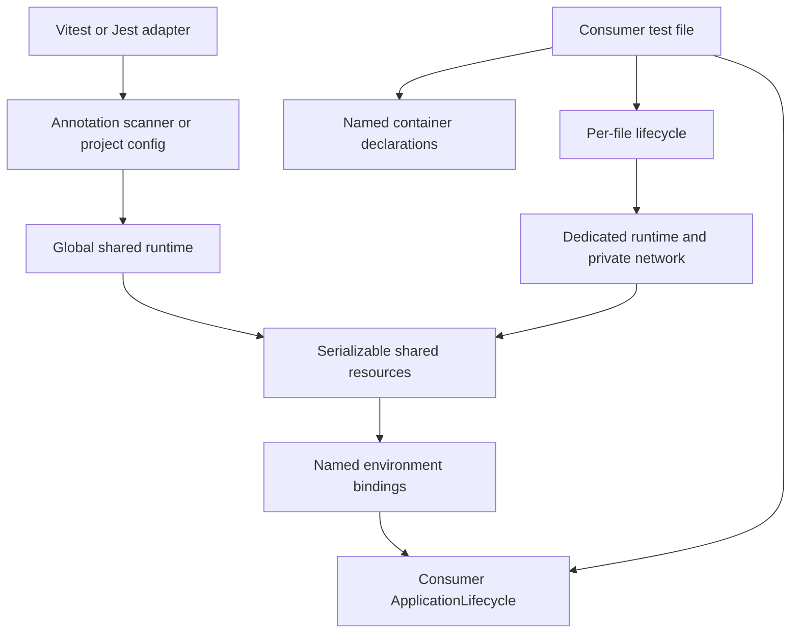

# Architecture

## Dependency direction

The core package does not import Vitest or Jest. Runner imports exist only under the `vitest` and
`jest` entrypoints. `ApplicationLifecycle` belongs to the consumer because only the consumer knows
how to construct and stop its application.

## Ownership

Global setup discovers or reads the named declarations whose isolation is `shared`. One global
`ContainerRuntime` starts those containers on one global network and global teardown stops them.
Only serializable connection facts cross the runner process boundary.

Each test file has an `IntegrationTestFileController`. Its first package-owned `beforeAll` selects
the shared resources declared by that file, lazily starts every `dedicated` declaration on one
private file network, merges both resource groups, installs environment bindings, and then starts
the consumer application. Its `afterAll` reverses that order: stop the application, restore the
environment, run preparation cleanup, then stop the dedicated containers and network.

Jest and Vitest own worker scheduling. Resource selection depends on the test file's named
declarations, never on a worker identifier. Two files assigned to the same worker still receive
different dedicated runtimes because runner module isolation creates a separate file lifecycle.
The helpers preserve user worker settings. Vitest `isolate: false` is rejected because it would
make file-specific module and environment state unsafe.

## Failure behavior

Container startup records every created adapter before awaiting readiness. A partial failure still
attempts to stop every created adapter and its network. Preparation cleanup, application stop,
environment restoration, container stop, and network stop aggregate errors without skipping later
cleanup actions.

When application bootstrap rejects before returning an application instance, the application
`stop` callback cannot be called. The file controller still restores the environment and
immediately stops its dedicated resources. Shared resources remain owned by global teardown.

A hard process termination cannot run application stop, file cleanup, or global teardown because
the JavaScript process no longer exists. Testcontainers' Ryuk resource reaper is the eventual
cleanup fallback for containers and networks labeled with that process session. The termination
fixture proves this separately from the normal in-process cleanup path and does not describe it as
graceful application shutdown.

## Network boundary

Shared containers use the global network. All dedicated containers for one file use that file's
private network. The supported mixed model is a host-side SUT connecting through mapped ports.
Direct container-to-container communication across the shared and dedicated networks is not
supported.

## Resource boundary

Adapters return serializable connection facts, not native Docker handles and not ORM-specific
URLs. Random host ports are read only after Testcontainers reports readiness. A consumer may
convert the facts to Prisma, Drizzle, TypeORM, MongoDB, or AMQP configuration in its composition
root. Multiple resources of the same kind remain distinct through their declaration names.

## Annotation boundary

Decorators record declarations only. They never start Docker and never contain secrets. Global
setup statically discovers exactly one literal named `@RequiredContainer({...})` declaration in
each matched annotation test file. Dynamic keys, spreads, computed expressions, missing isolation,
duplicate names, and conflicting shared name/kind declarations fail before containers start.
Runtime metadata verifies that `@ApplicationIntegrationTest` decorates the same marker class.
