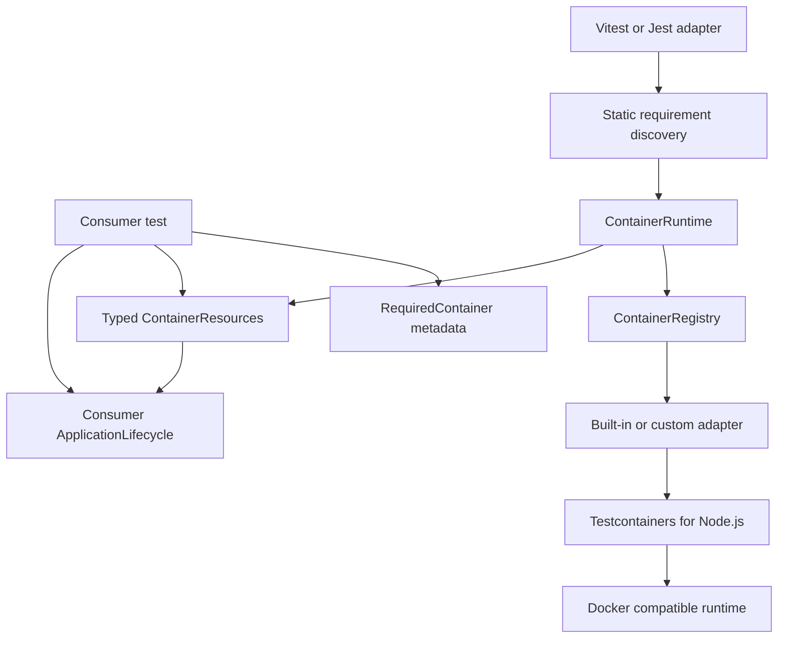

# Architecture

## Dependency direction

The core package does not import Vitest or Jest. Runner imports exist only under the `vitest`
and `jest` entrypoints. `ApplicationLifecycle` belongs to the consumer because only the
consumer knows how to construct and stop its application.

## Ownership

`ContainerRuntime` owns one network and one adapter instance per registered kind. Concurrent
starts reuse promises. Teardown stops containers in reverse successful-start order, then the
network. `IntegrationEnvironment` additionally owns an application and reverses startup order
during cleanup.

The global runner adapter creates a run-scoped runtime. Direct consumers create their own
runtime, which naturally gives suite or scenario scope. Cross-command reuse is intentionally
disabled because it makes isolation and failure ownership ambiguous.

## Resource boundary

Adapters return serializable connection facts, not native Docker handles and not ORM-specific
URLs. Random host ports are read only after Testcontainers reports readiness. A consumer may
convert the facts to Prisma, Drizzle, TypeORM, MongoDB, or AMQP configuration in its composition
root.

## Annotation boundary

Decorators record declarations only. They never start Docker and never contain secrets. Global
setup statically discovers literal `@RequiredContainer([Container.Name, ...])` expressions before
test modules execute. Runtime metadata validates application markers after module evaluation.
